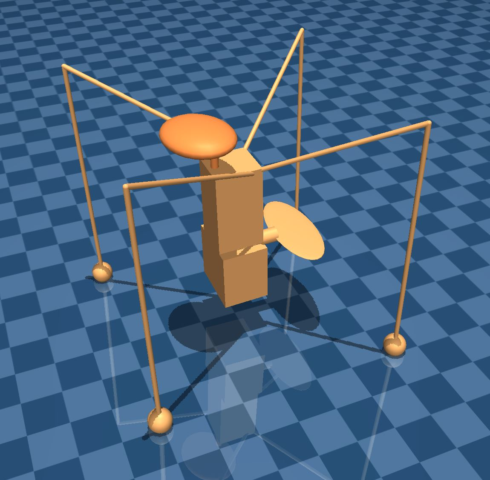

# jitterbug-dmc

A 'Jitterbug' under-actuated continuous control Reinforcement Learning domain,
implemented using the [MuJoCo](http://mujoco.org/) physics engine and
distributed as an extension to the
[Deep Mind Control suite (`dm_control`)](https://github.com/deepmind/dm_control).



## Installation

This package is not distributed on PyPI - you will have to install it from
source:

```bash
$> git clone github.com/aaronsnoswell/jitterbug-dmc
$> cd jitterbug-dmc
$> pip install .
```

To test the installation:

```bash
$> cd ~
$> python
>>> import jitterbug_dmc
>>> jitterbug_dmc.demo()
```

## Requirements

This package is designed for Python 3.6+ (but may also work with Python 3.5) 
under Windows, Mac or Linux.

The only pre-requisite package is
[`dm_control`](https://github.com/deepmind/dm_control).

## Usage

### DeepMind control Interface

Upon importing `jitterbug_dmc`, the domain and tasks are added to the standard
[`dm_control`](https://github.com/deepmind/dm_control) suite.
For example, the `move_from_origin` task can be instantiated as follows;

```python
from dm_control import suite
from dm_control import viewer
import jitterbug_dmc
import numpy as np

env = suite.load(
    domain_name="jitterbug",
    task_name="move_from_origin",
    visualize_reward=True
)
action_spec = env.action_spec()

# Define a uniform random policy
def random_policy(time_step):
    return np.random.uniform(
        low=action_spec.minimum,
        high=action_spec.maximum,
        size=action_spec.shape
    )

# Launch the viewer
viewer.launch(env, policy=random_policy)
```

### OpenAI Gym Interface

For convenience, we also provide an [OpenAI Gym](https://gym.openai.com/docs/)
compatible interface to this environment using the
[`dm2gym`](https://github.com/zuoxingdong/dm2gym) library.

```python
from dm_control import suite
import jitterbug_dmc

env = JitterbugGymEnv(
    suite.load(
        domain_name="jitterbug",
        task_name="move_from_origin",
        visualize_reward=True
    )
)

# Test the gym interface
env.reset()
for t in range(1000):
    observation, reward, done, info = env.step(
        env.action_space.sample()
    )
    env.render()
env.close()
```

### Heuristic Policies

We provide a heuristic reference policy for each task in the module
[`jitterbug_dmc.heuristic_policies`](jitterbug_dmc/heuristic_policies.py). 

### Tasks

This Reinforcement Learning domain contains several distinct tasks.
All tasks require the jitterbug to remain upright at all times.

 - `move_from_origin` (easy): The jitterbug must move away from the origin
 - `face_direction` (easy): The jitterbug must rotate to face a certain
   direction
 - `move_in_direction` (easy): The jitterbug must achieve a positive velocity in
   a certain direction
 - `move_to_position` (hard): The jitterbug must move to a certain cartesian
   position 
 - `move_to_pose` (hard): The jitterbug must move to a certain cartesian
   position and face in a certain direction 
   
### RL Algorithms

4 algorithms are implemented in the benchmark.py file, all directly using the stable-baselines library:

 - DDPG
 - PPO
 - SAC
 - TD3

### Autoencoders

TO DO

### Augmented Sequential Learning

TO DO

## Common Problems

### Ubuntu: Problems with GLFW drivers 

If you're using Ubuntu 16.04, you may have problems with the GLFW dirvers.
Switching to osmesa (software rendering) may fix this,

```bash
export MUJOCO_GL=osmesa
```

### OpenMPI Wheel Fails To Build


### `libprotobuf` Version Mismatch Error

We observed this happening sometimes on Ubuntu 16.04.5 LTS when running
`import jitterbug_dmc` from python, even when the installed version of protobuf
is correct.
It seems to be something wrong with the Ubuntu tensorflow build that gets
installed by pip.
However, this doesn't seem to stop the `benchmarks/benchmark.py` file from workgin.

```bash
[libprotobuf FATAL google/protobuf/stubs/common.cc:61] This program requires version 3.7.0 of the Protocol Buffer runtime library, but the installed version is 2.6.1.  Please update your library.  If you compiled the program yourself, make sure that your headers are from the same version of Protocol Buffers as your link-time library.  (Version verification failed in "bazel-out/k8-opt/genfiles/tensorflow/core/framework/tensor_shape.pb.cc".)
terminate called after throwing an instance of 'google::protobuf::FatalException'
  what():  This program requires version 3.7.0 of the Protocol Buffer runtime library, but the installed version is 2.6.1.  Please update your library.  If you compiled the program yourself, make sure that your headers are from the same version of Protocol Buffers as your link-time library.  (Version verification failed in "bazel-out/k8-opt/genfiles/tensorflow/core/framework/tensor_shape.pb.cc".)
```

Some links to more information;

 - https://devtalk.nvidia.com/default/topic/1037736/jetson-tx2/protobuf-version-error/
 - https://devtalk.nvidia.com/default/topic/1046492/tensorrt/extremely-long-time-to-load-trt-optimized-frozen-tf-graphs/post/5315675/#5315675
 - https://askubuntu.com/questions/1029394/protobuf-error-on-ubuntu-16-using-tensorflow
 - https://devtalk.nvidia.com/default/topic/1008180/tensorflow-and-protobuf-/
 - https://github.com/NVIDIA/DIGITS/issues/2061
 - https://stackoverflow.com/questions/46627874/protobuf-version-mismatch#50481381
